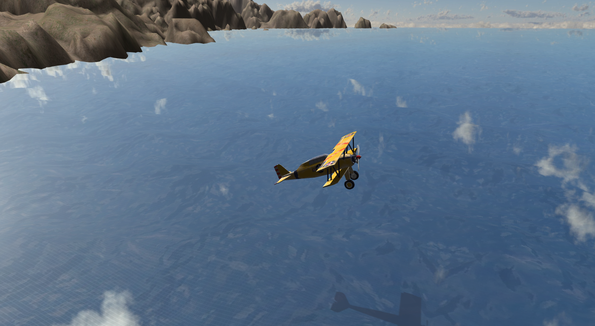
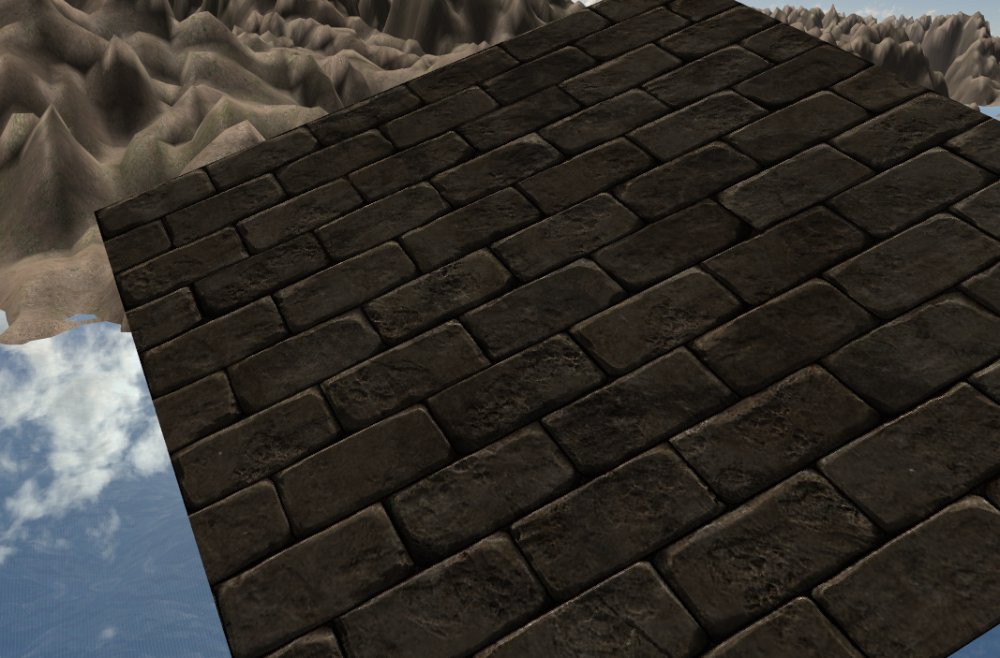
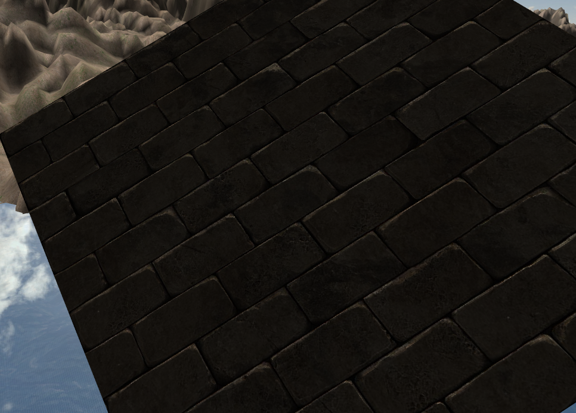
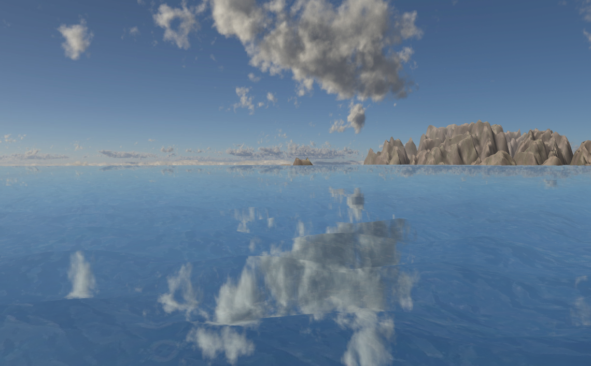

# PGRe-Project
 Small graphics engine impelemented in C++ / OpenGL for a computer graphics course @ VUT FIT (Erasmus).
 Done following [Victor Gordan's](https://github.com/VictorGordan/) OpenGL tutorial.

# Things implemented #
## Lighting, Shadow Mapping, Textures, Model Importer ##

## Normal Mapping ##

## Skybox, Cubemap reflections, Terrain Generation (not procedural), Water Animation ##

